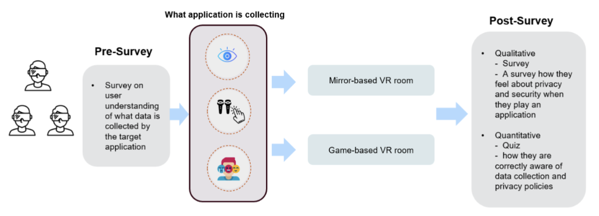
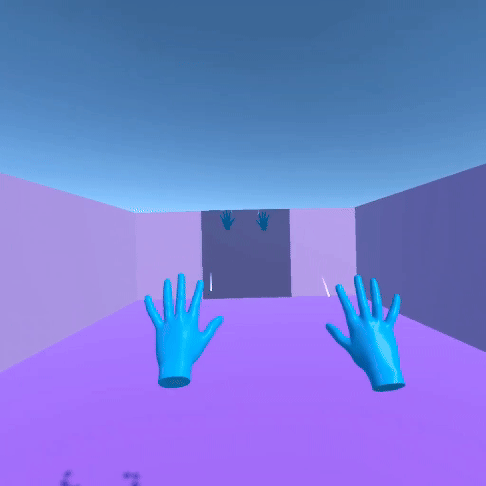

# Immersive-Privacy-and-Security-Awareness

JiHo Lee(jiholee@vt.edu), Carissa Bostian(carissab@vt.edu), Mughees Ur Rehman(mughees@vt.edu)

 As virtual environments (VEs) become more integrated into daily life, users are increasingly exposed to invisible data collection mechanisms, often without full understanding or meaningful consent. This study investigates how immersive and interactive VR experiences can be leveraged to improve user awareness of privacy policies and data collection practices. We designed two types of VR privacy rooms: a mirror-based room with low interactivity and a game-based room with high interactivity—each focusing on eye tracking, emotion tracking, and hand tracking. Through a within subjects study, participants experienced both approaches and were assessed through comprehension quizzes, Likert-scale evaluations, and open-ended feedback. Our results show that the game-based rooms significantly outperformed mirror-based ones in enhancing user understanding, perceived transparency, and caution toward data sharing. Participants in the interactive condition achieved higher quiz scores, reported greater awareness of data tracking, and expressed increased skepticism about third party data use. These findings suggest that integrating privacy education into interactive VR systems can be an effective approach to informing users and empowering informed decision-making in immersive contexts.

  

 

## Paper

You can find the paper [here](VRPrivacySecurity.pdf).

## System Setup

- Meta Quest Pro/Meta Quest 2
- Unity version 2022.3.52f1
- OpenXR package
- Unity Cloud
- Unity Version Control

## Built With

 
 

 

 

<h3>Mirror-Based Implementation</h3>
<li>Eye-Tracking</li>

  

<li>Emotion Tracking</li>

  
  

<li>Hand Tracking</li>

  

<h3>Game-Based Implementation</h3>
<li>Eye-Tracking</li>

  

<li>Emotion Tracking</li>

  

<li>Hand Tracking</li>

  

## Installation Guide for APK Files on Meta Quest Pro

### Prerequisites
1. **Enable Developer Mode on Meta Quest Pro**
   - Open the Oculus app on your smartphone.
   - Go to `Settings` > `Device` > `Developer Mode` and enable it.
   - Follow the on-screen instructions to complete the setup.

2. **Install SideQuest on Your PC**
   - Download and install SideQuest from the [official SideQuest website](https://sidequestvr.com/setup-howto).
   - Follow the installation instructions provided.

### Steps to Install APK Files

1. **Connect Meta Quest Pro to Your PC**
   - Use a USB cable to connect your Meta Quest Pro to your PC.
   - Put on your Meta Quest Pro headset and accept the prompt to allow USB debugging.

2. **Open SideQuest**
   - Launch SideQuest on your PC.
   - Your Meta Quest Pro should appear in the top left corner of SideQuest, indicating a successful connection.

3. **Install APK Files**
   - In SideQuest, click on the button that shows the installed apps (usually marked in red).
   - Drag and drop the APK file into the SideQuest window.
   - The installation process will begin automatically. Once completed, a confirmation message will appear.

### Playing the Installed APK Files

1. **Accessing Installed Apps**
   - Put on your Meta Quest Pro headset.
   - Go to the `Library` section.
   - Under `Unknown Sources`, you will find the apps you have installed via SideQuest.

2. **Enable Eye Gaze and Natural Facial Expressions**
   - Go to the app settings within the Meta Quest Pro.
   - Navigate to the "Tracking" or "Input" section.
   - Enable the options for "Eye Gaze Tracking" and "Facial Expression Tracking".
   - Follow any additional on-screen instructions to calibrate and configure these features.

3. **Launching the App**
   - Select the app you want to play.
   - Follow any on-screen instructions to set up or configure the app.

